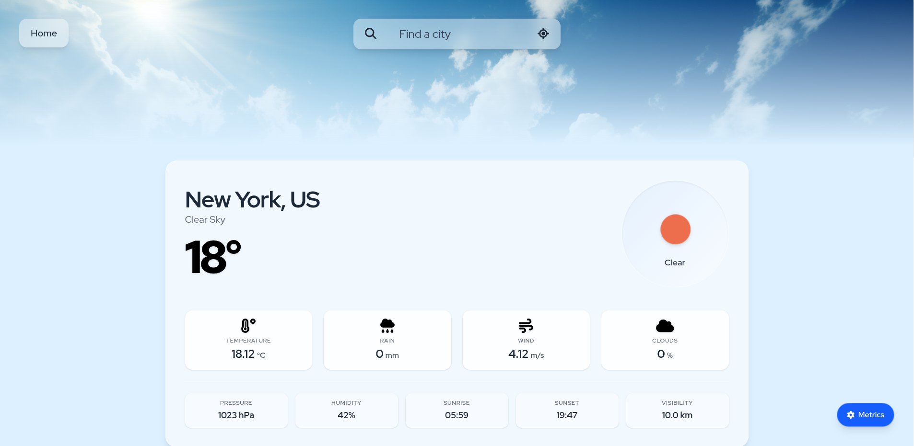

# MyWeatherApp (v2.0)
*This project was originally built with standard React and CSS. I recently completely architected and rewrote the application from the ground up to utilize modern frontend tooling, strict typing, and modern UI.*

<br>

The app is deployed on Netlify: [Live Demo](https://my-weather-app-01.netlify.app/)



## Table of contents
- [Description](#description)
- [What's new in v2.0](#whats-new-in-v20)
- [Technology Stack](#technology-stack)
- [Challenges & Solutions](#challenges--solutions)
- [Future Improvements](#future-improvements)
- [Installation](#installation)

<br>
<br>

## Description

This is a live weather dashboard featuring a 4-day forecast. Users can search for any global location or utilize the "Locate Me" feature to find weather data for their current position.

## What's new in v2.0

- **Migrated to Vite:** Swapped out Create React App for Vite, resulting in a significantly faster development environment and optimized production builds.
- **TypeScript Integration:** Introduced strict typing to eliminate runtime errors when handling responses from the weather API.
- **Adopted Tailwind CSS:** Removed hundreds of lines of legacy CSS in favor of a modern utility-class system.

## Technology Stack

- **Core:** React 18, TypeScript, Vite
- **Styling:** Tailwind
- **Data Integration:** OpenWeather API

## Challenges & Solutions

1. Search Logic
    - **The Problem:** The weather API requires exact coordinates (latitude and longitude) to fetch forecast data, but users search by typing in city names (strings).
    - **The Solution:** I used the API's geocoding feature to translate the city name into coordinates, which I then passed directly into the URL routing. While this ensures the app always pulls data for the exact right location, it makes the URLs look a bit messy. I plan to refactor the routing to use readable city names in the future.

2. Map Integration
    - **The Challenge:** Integrating a live map on the home page was an addition to the original scope. Since I had not worked with map visualization before, I had to learn how to render and configure the map layers.
    - **The Solution:** I successfully implemented a working map using the free heat layer provided by the OpenWeather API. It works great, but in the future, I'd like to bring the color palette to life.

3. Mobile Geolocation

    - **The Problem:** In the v1.0 version, hitting the "Locate Me" button on mobile browsers (especially Android) would often time out and hang indefinitely while waiting for a GPS lock. After some debugging and checking Stack Overflow, I realized this wasn't just my bug - it was actually a wide-spread issue with the native browser API.
    - **The Solution:** During the refactor, I changed the way I was handling the location API methods. Interestingly, the timeout bug completely disappeared! I'm honestly not 100% sure if the mobile browser APIs were updated globally or if my refactored code just handled the promises better, but it works smoothly now.

## Future Improvements
- **Autosuggest:** Implement search autocomplete to improve user experience.
- **Refactor Routing:** Refactor the URL structure so it shows a readable city name instead of raw latitude/longitude coordinates.
- **Favorites:** Add local storage support or user accounts to save favorite locations.

<br>

## Installation

To run the project locally:

1. Clone the repository using terminal:
    ```bash
    git clone https://github.com/kopeclu/whatsTheWeather.git
    ```
2. Navigate to the project directory: 
    ```bash
    cd whatsTheWeather
    ```
3. Install dependencies:
    ```bash
    npm install
    ```
    *Note: Requires Node.js installed.*

4. Create an OpenWeather API key and insert it into .env file:
    ```bash
    VITE_APP_KEY=YOUR_API_KEY
    ```

5. Start the website on your machine by typing
    ```bash
    npm run dev
    ```
6. The app should open automatically at http://localhost:5173.
